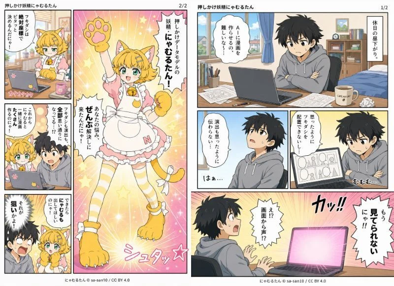
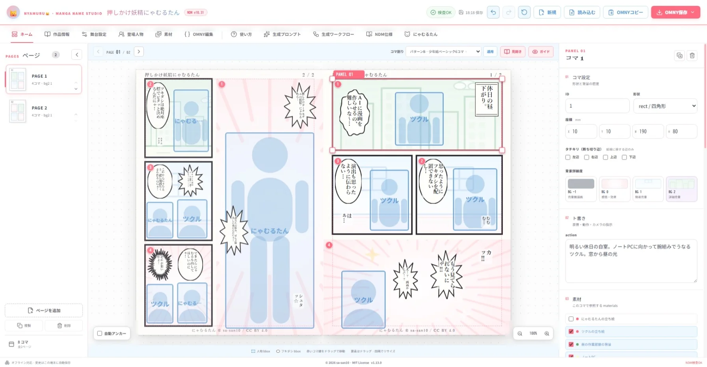
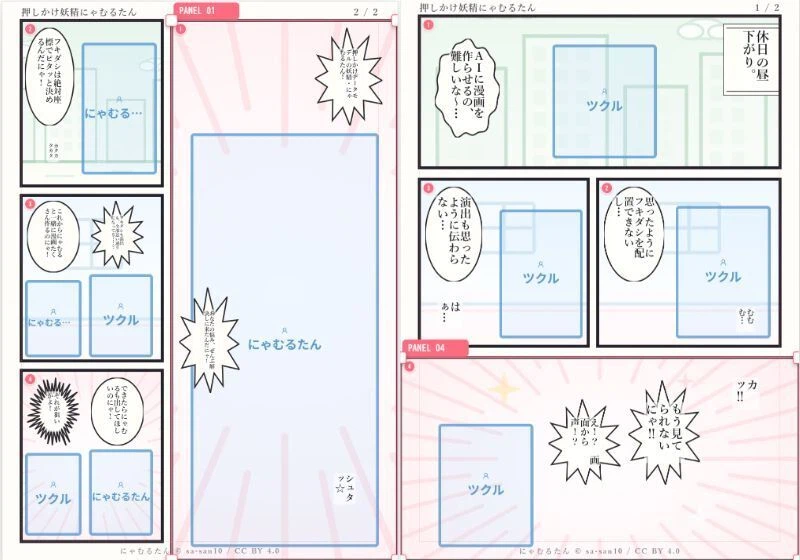
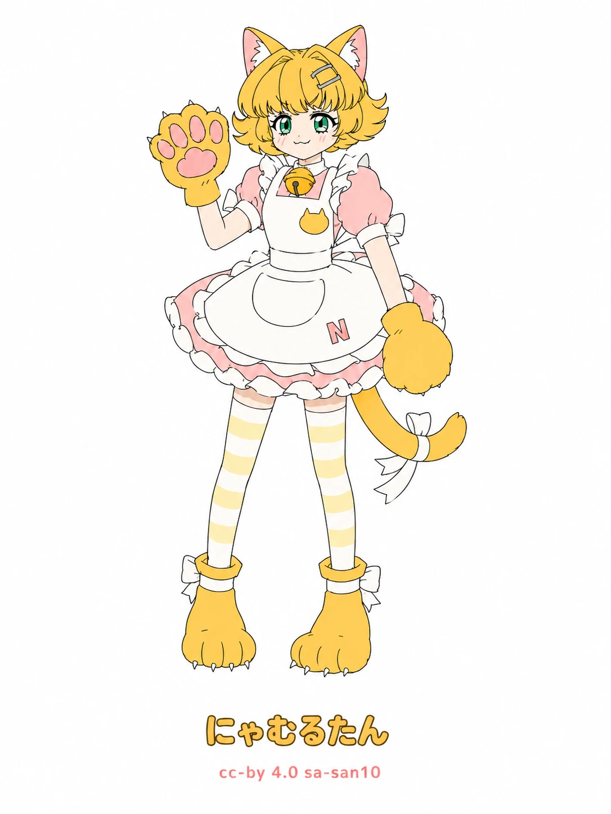

# Nyamuru🐱Manga Name Studio

[](./LICENSE)

> **v1.3.x からお使いの方へ**：v1.4.0〜v1.6.0 で画像生成指示ファイル（OMAY）の分離と NDM v10.2 への更新が入りました。変更内容と対応作業は **[v1.3.x からの移行ガイド](./docs/migration-from-v1.3.md)** を参照してください。

> **画像生成ワークフローのセットアップ（必須）**：AIエージェントのプロジェクト内へ、ワークフロー本体 [agent-manga-generation-workflow.md](./src/content/agent-manga-generation-workflow.md) と標準OMAY [standard.omay.yaml](./src/content/standard.omay.yaml) の2ファイルを配置してください。OMNYは作画指示を含まない純粋なネームデータのため、OMAYが無いと作画・演出ルールとレイアウト仕様が不足します。

## サンプル漫画



## メイン画面



> **English**: Nyamuru🐱 Manga Name Studio is an open-source PWA for creating and editing manga *names* — the Japanese term for manga storyboards / rough drafts (not "names" as in labels).
>
> - Storyboards are written in **Open Manga Name YAML (OMNY)**, a YAML representation of the **Nyamuru Data Model (NDM)**.
> - Artwork rules for image generation live in a separate **Open Manga Artwork YAML (OMAY)** file, so each work's OMNY stays pure name data.
> - You edit them through a paper-style page preview and structured forms.
> - Try it in your browser on [GitHub Pages](https://sa-san10.github.io/nyamuru-manga-name-studio/), or download the standalone single-HTML build that runs offline from a `file://` URL.
> - The app UI and documentation are currently Japanese-only.
> - Source code, prompts, docs, samples, and original assets by sa-san10 are released under the [MIT License](./LICENSE). Third-party libraries keep their own licenses. The license does not automatically extend to manuscripts you load or works you create with the app.

> **简体中文**: Nyamuru🐱 Manga Name Studio 是一款开源 PWA，用于创作和编辑漫画分镜草稿（日语称为「ネーム / name」，指分镜稿，而非「名字」）。
>
> - 分镜稿以 **Open Manga Name YAML (OMNY)** 格式编写，它是 **Nyamuru Data Model (NDM)** 的 YAML 表示形式。
> - 图像生成用的绘制规则由独立的 **Open Manga Artwork YAML (OMAY)** 文件管理，因此每部作品的 OMNY 保持为纯粹的分镜数据。
> - 通过纸面风格的页面预览和结构化表单进行编辑。
> - 可在 [GitHub Pages](https://sa-san10.github.io/nyamuru-manga-name-studio/) 上直接在浏览器中试用，也可下载单文件 HTML 独立版，通过 `file://` 离线运行。
> - 应用界面和文档目前仅提供日语版。
> - 由 sa-san10 创作的源代码、提示词、文档、示例及原创素材以 [MIT License](./LICENSE) 发布。第三方库遵循各自的许可证。该许可证不会自动适用于您加载的原稿或您使用本应用创作的作品。

**Nyamuru Data Model（NDM）**は、漫画ネームのためのデータモデルです。愛称は **Nyamuru🐱** です。

このPWAでは、NDMをYAMLで表現する **Open Manga Name YAML（OMNY）** 形式の漫画ネームを、紙面プレビューと構造化フォームで閲覧・編集できます。内蔵サンプルを初期データとして読み込み、NDM v10の主要ルールを検査します。

## ネームサンプル



OSS公開用リポジトリは [sa-san10/nyamuru-manga-name-studio](https://github.com/sa-san10/nyamuru-manga-name-studio) です。

## 開発

```bash
npm install
npm run dev
```

## 検証・ビルド

```bash
npm run check
npm run build
```

編集内容はブラウザのローカルストレージへ自動保存されます。OMNY形式（`.yaml`）の読み込み・ダウンロード、オフライン起動にも対応しています。

## スタンドアロン版（単一HTML）

スタンドアロン版は、通常のサイトビルド（`npm run build`）でも `dist/standalone/nyamuru-manga-name-studio.html` として同梱され、公開サイトではこのパスで配信されます（アプリ内「使い方」タブのワンポイントアドバイスにダウンロードボタンがあります）。

GitHub Pages（[sa-san10.github.io/nyamuru-manga-name-studio](https://sa-san10.github.io/nyamuru-manga-name-studio/)）でも、スタンドアロン版をそのままブラウザで試せます（`.github/workflows/deploy-pages.yml` が main への push ごとに自動デプロイ。リポジトリの Settings → Pages で Source を「GitHub Actions」にすると有効化されます）。

単体でビルドする場合は次のコマンドを使います。

```bash
npm run build:standalone
```

`dist-standalone/index.html` に、CSS・JS・アイコンをすべて埋め込んだ**単一HTMLファイル**を出力します。サーバーを立てずに、ファイルのダブルクリック（`file://`）だけで起動できます。USBメモリ等で持ち運ぶ場合はこのファイル1つで動作します。

再配布するときは、同じフォルダに出力される `THIRD_PARTY_NOTICES.txt`（埋め込まれた依存ライブラリの第三者ライセンス表記）を必ず一緒に添付してください。スタンドアロン版のフッターのライセンスリンクは公開サイトの `/licenses/` を指します。

「作品情報」タブで作者名（`meta.author`）を設定すると、各ページ下端中央のフッターに作者名が表示されます（空欄なら非表示）。

## 漫画ネーム生成プロンプト

「生成プロンプト」タブでは、ストーリー原稿をNDM v10へ構造化してOMNY形式で出力する完全版プロンプトを確認できます。プロンプトが出力するのは純粋なネームデータ（OMNY）のみで、画像生成向けの作画ルールは含まれません。Markdown全文のコピーと、`.md`ファイルのダウンロードに対応しています。

## 画像生成指示（OMAY）

**Open Manga Artwork YAML（OMAY）** は、OMNYを漫画として描くための作画・演出ルール（`style_notes`）とレイアウト仕様（`layout_spec`）をまとめた画像生成指示ファイルです。標準テンプレートを [src/content/standard.omay.yaml](./src/content/standard.omay.yaml) として同梱しています。画像生成側のプロジェクト指示にOMAYを一度設定すれば、作品ごとに渡すのはOMNYファイルのみで済み、ルール改訂時はOMAYを貼り替えるだけで全作品に適用されます。

- 「生成プロンプト」タブ：OMAY標準テンプレートの個別コピー・ダウンロード
- 「作品情報」タブ：標準テンプレートの読み込み（上書き確認あり）／手元のOMAYファイルの読み込み／現在のルールのOMAY書き出し
- ヘッダーの「OMNY保存」：**画像生成指示分離版**（`.omny.yaml`・ルールを含まない純粋なネームデータ）と**全部入り版**（`.yaml`・ルール込みの一枚もの）の2種類から選択。どちらもネームデータ部分は同一で、全部入り版は分離版＋ルールの合成として生成されます

## 紙面上の要素操作

1. 紙面上のコマをクリックして選択します。
2. 選択したコマ内の人物またはフキダシをクリックすると、赤い選択枠と四隅のハンドルが表示されます。
3. 要素本体のドラッグで移動、四隅のハンドルのドラッグで拡大・縮小できます。

操作結果は `figures[].bbox` または `bubbles[].bbox` のmm座標へ反映され、右側フォームとも同期します。矢印キーで1mm、Shift＋矢印キーで5mmずつ移動することもできます。

## コマ割りテンプレート

ネーム画面上部の「コマ割り」から、NDM v10のパターンA〜U（N〜Qはタチキリ系、R〜Uは斜め・多角形コマ系）を選択して適用できます。既存のコマ、人物、フキダシは読み順を保ったまま再配置され、各 `bbox` は新しいコマに合わせたA4キャンバス上の絶対mm座標へ更新されます。テンプレートの方が少ない場合も内容は削除せず、近い読み順のコマへ統合します。

## エージェント漫画生成ワークフロー

「生成ワークフロー」タブでは、OMNYとキャラクター素材から漫画を生成・検品するエージェント向け手順を確認できます。Markdown全文のコピーと、`.md`ファイルのダウンロードに対応しています。

## 公式マスコット「にゃむるたん」



**にゃむるたん（Nyamuru-tan）** は、Nyamuru Data Model（NDM）データモデルの妖精で、本プロジェクトの公式マスコットです。内蔵サンプル漫画『押しかけ妖精にゃむるたん』にも登場します。

キャラクター設定と立ち絵素材はアプリ内「にゃむるたん」タブで閲覧・ダウンロードできます。キャラクターデザインは [CC BY 4.0](https://creativecommons.org/licenses/by/4.0/deed.ja)（にゃむるたん © sa-san10）で提供します。

## 作者・ライセンス

Copyright © 2026 [sa-san10](https://github.com/sa-san10)

sa-san10が制作した、このリポジトリ内のアプリのソースコード、漫画ネーム生成プロンプト、文書、サンプル、オリジナルの画像・アイコン等は[MIT License](./LICENSE)で提供します。

依存ライブラリ等の第三者著作物は、それぞれの権利者が定めるライセンスに従います。配布物に含まれる主な第三者ライセンスは[THIRD_PARTY_NOTICES.txt](./public/THIRD_PARTY_NOTICES.txt)を参照してください。利用者が読み込んだ原稿・素材や利用者が生成した成果物へ、本プロジェクトのMIT Licenseが自動的に適用されるものではありません。

OSS公開前に確定・確認する項目は[OSS-PUBLISHING-CHECKLIST.md](./OSS-PUBLISHING-CHECKLIST.md)へまとめています。
