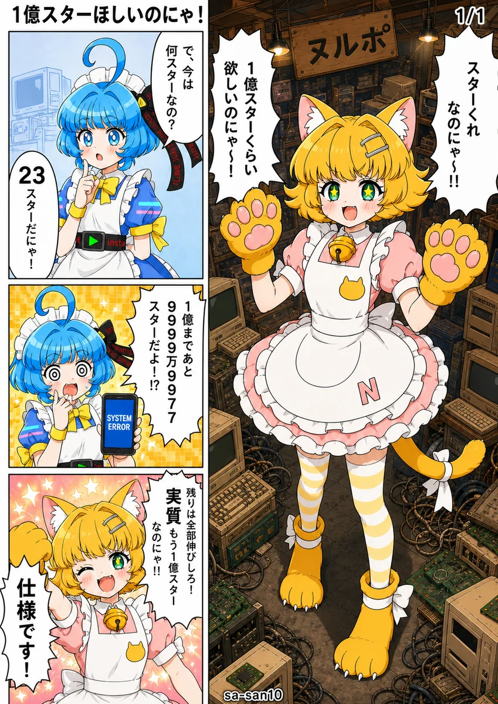
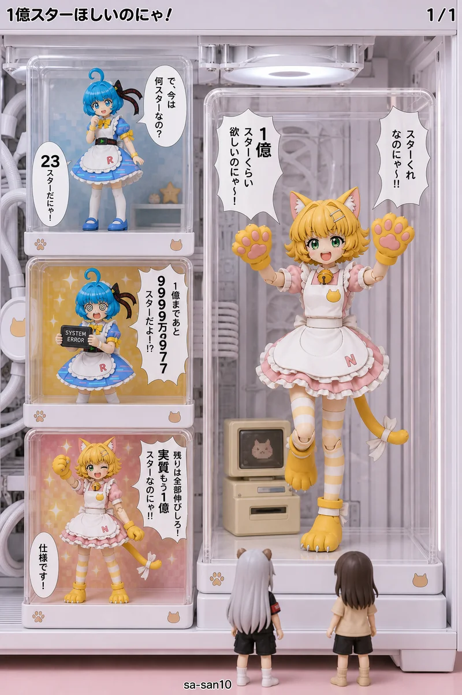

# 🎭 同じネームから、絵柄だけ入れ替える

> 制作時の版：NDM（OMNY）10.3 ／ 標準OMAY v10.5 ／ コマ割りパターンN（タチキリ見得切り）／ 2026-08-15

| 漫画 | ミニチュア |
|:---:|:---:|
|  |  |

<sub>にゃむるたん © sa-san10 / CC BY 4.0</sub>

この2ページは、**同じネーム（`.omny.yaml`）から生成されています。**

コマの座標も、セリフも、キャラの立ち位置も、フキダシの並びも、**1バイトも違いません**。
違うのは `meta.style_notes` の中身だけです。

```yaml
# 漫画版
meta:
  style_notes: []          # 何も書かない＝OMAY の初期値で描かれる

# ミニチュア版
meta:
  style_notes:
    - "画風: 白い水冷ゲーミングPCの内部を真横から接写した写真。ケース・ラジエーター・
       チューブ・基板まですべて白で統一されている。背後の壁は淡いピンク…"
    - "🖼️ 1コマ＝1個の独立した透明アクリルの展示ケースで、それぞれの中に
       そのコマの情景だけが完結して作り込まれている…"
    - "🪆 人物は全員、1/12スケールの塗装済み可動アクションフィギュアである…"
```

---

## なぜ入れ替えられるのか

漫画のネームには、性質の違う2種類の情報が混ざっています。

|  | 例 |
|---|---|
| **壊してはいけないもの** | 読み順、コマの数、セリフの文字、誰がどこにいるか、タチキリの範囲 |
| **差し替えたいもの** | 線の質、色、光、素材、質感、カメラ |

**OMNY**（Open Manga Name YAML）は前者を書きます。
**OMAY**（Open Manga Artwork YAML）は後者を決めます。

v10.5 で、この2つの間に**明示的な適用優先順位**が入りました。

```
[const] ＞ omny.yaml の layout_spec / style_notes ＞ [must] ＞ [panel] ＞ [style] ＞ [default]
```

OMAY の各行には、この6段階のどれかがタグとして付いています。

```yaml
# 絵柄が変わっても動かない
- "[const] ページは右綴じ、コマは右上→左下の順（id 番号の昇順）に読む"
- "[const] OMNY の panels に列挙されたコマは、1ページ内に必ず全て描く"

# 作品ごとに差し替えてよい
- "[style] カラー漫画。線画＋ベタ塗り、必要に応じてグラデーション"
- "[style] 通常の辺(bleed なし): 外周に約2〜3mmの白マージンを取り、太さ約1mmの黒い枠線を描く"
```

**`[style]` を全部書き換えても、`[const]` は動きません。**
だから絵柄を丸ごと差し替えても、漫画としての構造は壊れないのです。

---

## 絵柄が変わると、指定は「翻訳」される

差し替えは「見た目を上塗りする」のではありません。
**同じ指定が、その絵柄の物理で説明できる形に翻訳されます。**

| OMNY / OMAY の指定 | 漫画では | ミニチュアでは |
|---|---|---|
| コマ枠 | 太さ1mmの黒い線 | **アクリル板の厚みと、台座の縁** |
| `bleed: [right, bottom]` | 紙の端まで絵を断ち切る | **展示ケースが紙の端まで届く大きな箱になる** |
| フキダシ | インクで描かれた白い風船 | **ケースの内側に貼られた、切り抜いた紙** |
| フキダシの尻尾 | 三角に尖った線 | **紙の一部として切り出された、先の丸い三角** |
| `bg: 0`（具体的背景なし） | 感情色のグラデ＋集中線 | **ケースの背板に貼られた色紙** |
| キャラの識別記号 | 髪の色、耳の形、エプロンの文字 | **成型パーツの彫刻、塗り分け、極小のタンポ印刷** |

これは OMAY の `[const]` に書かれています。

```yaml
- "[const] 画風を変えるときも、キャラクターの識別記号（特徴的な髪・耳・
   衣装のパーツ・固有色・体の特徴）は省略せず、その画風の描き方に翻訳して残す。
   「その画風では描けないから省く」は認めない——線で描けないなら面で、
   面で描けないなら色で、色で描けないなら形で残す"
- "[const] 識別記号は、その画風の物理・材料で説明のつく形に翻訳する
   （例: ドット絵のキャラを実写の世界に置くなら、印刷されたアクリルスタンドとして置く。
   ステンドグラスなら、ガラスは正方形にしか切れないという理由でドットの角を保つ）"
```

**「その画風では描けないから省く」を禁じている**のがポイントです。
省略を許さないと、生成側は**翻訳するしかなくなります**。

---

## 作品側から、ネームの指定を無効化できる

優先順位の表には、もうひとつ実用的な帰結があります。

`omny.yaml の style_notes` は `[panel]` より**上位**にあります。
つまり**作品の作者が、ネームのコマ単位の指定を意図的に無効化できます。**

```yaml
# ミニチュア版の style_notes（抜粋）
- "🚨 この版では、OMNY の panels に書かれた size の指定（face / bust-up / waist-up など）を
   採用しない。展示ケースの中の人形は実在する模型なので、コマが変わっても大きさは変わらない
   ——すべての人物を、すべてのコマで、同じ 1/12 スケールの全身で写す"
```

漫画版では `size: face` が顔のクローズアップになりますが、
ミニチュア版では**カメラが寄るのではなく、人形が全身のままケースの中にいる絵**になります。

※完全に上書きできない場合もあります。ジオラマ版３コマ目が全身になっておらず、１コマ目は他よりも大きい全身フィギュアとして描画されている。

---

## 商品名を書かずに、それっぽく描く

副次的な効果ですが、この分離は**商標の回避**にも効きます。

絵柄の指示を「**名前**」ではなく「**形と素材**」で書くと、実在の製品名を1つも出さずに、
それらしい情景が出てきます。

```yaml
# ❌ 名前で書く（実在の製品名が絵に描き込まれる）
note: "天井まで積まれた PC-98 や CRT モニターの山"

# ✅ 形と素材で書く
note: "天井まで積まれた古いパソコンの筐体（ベージュに黄ばんだ樹脂の箱型本体。
       前面に薄い四角い差し込み口が2つ縦に並ぶ）と、
       奥行きの深いガラス画面の表示装置の山"
```

上の作例では、**画像内に実在のブランド名・型番・ロゴは1つもありません。**
描かれている文字は、作品オリジナルの店名と、意味のない型番風の記号だけです。

---

## 使い方

**OMAY は一度だけ設定します。**

1. ChatGPT（プロジェクト機能）などの画像生成AIを開く
2. `standard.omay.yaml` の中身を、**プロジェクト指示に丸ごと貼る**
3. 以降、作品ごとに渡すのは **`.omny.yaml` だけ**

```
プロジェクト指示  ←  standard.omay.yaml（1回貼るだけ・以後さわらない）
    │
    ├─ 作品A.omny.yaml  →  ページ画像
    ├─ 作品B.omny.yaml  →  ページ画像
    └─ 作品C.omny.yaml  →  ページ画像
```

**絵柄を変えたいときも、`.omny.yaml` の `meta.style_notes` を書き換えるだけです。**
プロジェクト指示（OMAY）は触りません。

OMAY のルールを改訂したくなったら、**プロジェクト指示を貼り替えるだけで全作品に適用されます。**

維持が難しい特徴などはOMNY送信時のチャット欄で念押しする方法も有効です。

---

## 作例

| 絵柄 | `style_notes` に書いたこと |
|---|---|
| **漫画**（既定） | 何も書かない（OMAY の初期値で描かれる） |
| **ミニチュア** | 白い水冷PCの内部、透明アクリルの展示ケース、1/12 の可動フィギュア、白く均一な光 |
| **ドールハウス** | 1/12 のジオラマ、布の衣装、植毛の髪 |
| **アクションフィギュア** | 全身プラスチックの成型、差し替え表情パーツ、成型された髪と服 |

同じネームで、羊毛フェルト・アイロンビーズ・ステンドグラス・切り絵・水墨画なども通ります。
**材料の物理を書くと、その材料でしか作れない形に絵が寄っていきます。**

---

## ファイル

作例はサンプル作品『**1億スターほしいのにゃ！**』（1ページ・4コマ・コマ割りパターンN）。にゃむるたんが全身の見得切りでリポジトリのスターをおねだりし、らきもたん（電子の妖精・ツッコミ役）が現実を突きつけるが、超ポジティブに着地する話です。

- [A_漫画版_パターンN.omny.yaml](./A_漫画版_パターンN.omny.yaml) — 漫画版のネームデータ（画風指定なし）
- [E_PC内アクリル展示版_パターンN.omny.yaml](./E_PC内アクリル展示版_パターンN.omny.yaml) — ミニチュア版（PC内アクリル展示）のネームデータ。`meta.style_notes` に画風ブロックを足しただけで、他は漫画版と同一
- [images/](./images/) — 生成結果（webp・長辺1200px に縮小）

© 2026 sa-san10
